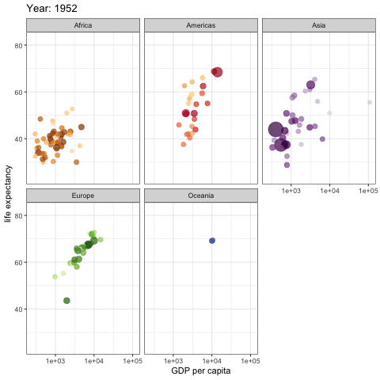

# Harvard Data Science Animation Contest Sumbission Template

This is the *main* file that judges will be looking at. It should be cleanly formatted and easy to understand.

- *use this file as a template for your submission, editing and inserting your own information and work appropriately.*
- *for help with formatting a markdown file like this one, visit https://guides.github.com/features/mastering-markdown/*
- *for examples of how to format the code portion of your submission, go to [Code Examples](CodeExamples) in the repo*
- ***IMPORTANT: make sure to name this file firstnamelastname_submission.md***

If you are directly editing this file, don't forget to delete everything in this top section before submitting!
##

# SUBMISSION TITLE

**Author**: Harry Potter

**Affiliation**: B.S Arithmancy Candidate, Hogwarts School of Witchcraft and Wizardry
##

**Artifact:**
*Insert embedded .gif of submission [(see how to)](https://stackoverflow.com/questions/34341808/is-there-a-way-to-add-a-gif-to-a-markdown-file) OR link to web app:*

**Code:** *Insert [link to code file](CodeExamples/harrypotter_code.Rmd) from repo*

### Explanation

This visualization helps to build a more intuitive understanding of XYZ. This is because...
